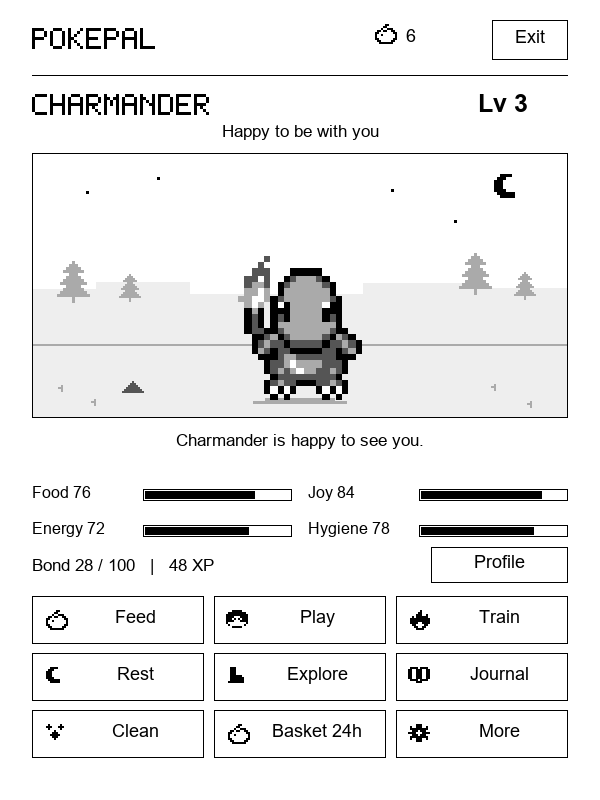
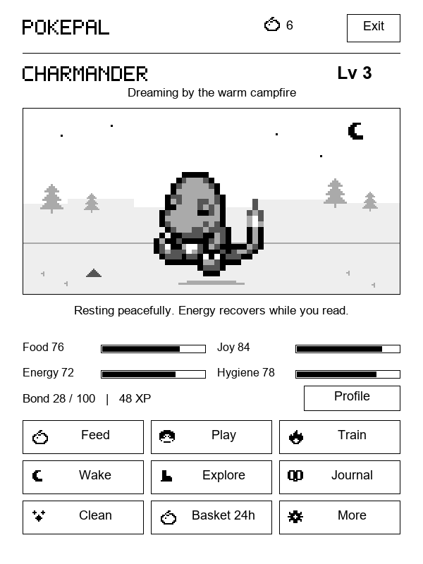

# PokePal for Kindle



PokePal is a small offline pet game for KOReader on a jailbroken Kindle. You start with Charmander. Feed it, play a three-bush memory game, practise moves, or send it on an expedition. With enough XP and bond, it can evolve into Charmeleon and then Charizard.

The screen stays still most of the time. Charmander has short idle, sleeping, walking, and attack animations; they stop when the Kindle sleeps. Care and expeditions use elapsed time when you next open the game, so there is no background polling or wake alarm. Battery use has not been measured on a physical Kindle yet.

 

## Install

You need a working [KOReader](https://github.com/koreader/koreader) installation. KUAL can start KOReader, but PokePal itself lives in KOReader's menu.

1. Download [PokePal-v0.2.0-kindle.zip](https://github.com/itsParassharma/kindle-pokepal/raw/refs/heads/main/dist/PokePal-v0.2.0-kindle.zip).
2. Connect the Kindle by USB. Open the ZIP and merge its `koreader` folder into the top level of the Kindle drive. The resulting file should be `koreader/plugins/pokepal.koplugin/main.lua`.
3. Safely eject the Kindle and restart KOReader.
4. In KOReader, open **Tools → More tools → PokePal – Pokemon companion**. If it is missing, check **Tools → More tools → Plugin management** and restart KOReader.

The longer [install and play guide](pokepal.koplugin/INSTALL.txt) covers controls, evolution, saves, and troubleshooting. Existing 0.1 saves remain readable. Your save lives in KOReader's settings directory as `pokepal.dat`; back it up before changing devices.

## In the game

- **Care:** feed, clean, rest, and wake your partner. The Play, Train, and Basket buttons show their cooldowns.
- **Play and train:** finish the berry-trail memory game or practise moves to earn XP and bond.
- **Explore:** choose an offline trail, then collect its berries, XP, and Pokémon sighting later.
- **Keep track:** browse the field journal, badges, and 24 recent activities.
- **Choose the pace:** Eco animation is the default for new saves; Gentle and Off are in Settings.

The game is forgiving about time away. Your partner does not die, and nothing needs to run while the Kindle is asleep.

## Source and testing

The KOReader plugin is in [`pokepal.koplugin`](pokepal.koplugin). It is plain Lua plus grayscale sprite frames; it needs no network connection after installation. The ZIP in [`dist`](dist) is ready to copy to a Kindle.

To run the desktop checks, install Python 3, then run:

```sh
python -m pip install -r requirements-dev.txt
python tests/test_and_render.py
```

These checks cover game rules, save recovery, animation scheduling, and several screen sizes using mocked KOReader APIs. They do not replace a test on the Kindle. The images above are renders of the game's view code with desktop fonts, not photographs of the device.

## Art and license

This is an unofficial fan project. The game code and original UI drawings are MIT licensed under [`LICENSE-CODE.txt`](pokepal.koplugin/LICENSE-CODE.txt). Pokémon names and sprites belong to their respective rights holders. The Charmander line uses adapted PMDCollab pose sheets; other Pokémon use sampled Gen V sprites. Sources, artist records, and applicable sprite terms are in [`CREDITS.txt`](pokepal.koplugin/CREDITS.txt) and the included sprite license files. The code license does not cover those assets.
